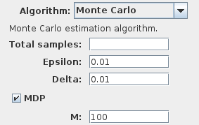
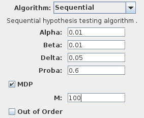
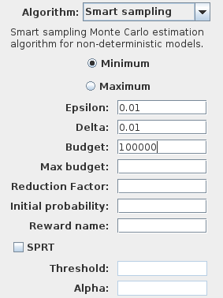
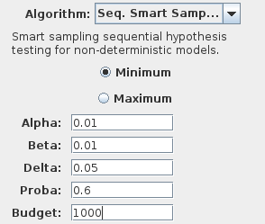

Probability estimation for MDPs
===============================

Markov Decision Processes (MDP) interleave nondeterministic actions and probabilistic transitions.
Such models comprises probabilistic subsystems whose transitions depend on non the states of the other subsystems,
while the order in which concurrently enabled transitions execute is nondeterministic. This order may radically
affect the probability to satisfy a given property. It is therefore useful to evaluate the upper and lower bounds of these probabilities.

To calculate the expected probability of a sequence of states, is is necessary to define how the nondeterminism in the MDP will be resolved.
We use the term scheduler to define such a strategy. Given a MDP with a set of action **A**, a set of states **S** and the set of sequences of states **T**,
a history-dependent scheduler is a function from **T** to **A**. A memoryless scheduler is a function from **S** to **A**. We are interesting in finding optimal
schedulers that maximize or minimize the probability to satisfy BLTL properties.

Nondeterminism in RML
^^^^^^^^^^^^^^^^^^^^^

Nondeterminism naturally occurs when several transitions are enabled in the same state.
If the model is declared using the keyword ``dtmc``, PLASMA Lab will not consider the
model as nondeterministic, but will apply a uniformly distributed choice between the different possible transitions.

MDP are the default model in RML. It can also be specified with the keyword ``mdp`` at the beginning of the model.
By default (or by using the keywords ``mdp sml``) the model considers only **memoryless schedulers**.
To consider **history dependent schedulers** the model must be declared with the keywords ``mdp shd``.

In PLASMA Lab the default behavior to simulate and therefore check MDP models is to randomly select a scheduler
for each new simulation. This behavior happens in PLASMA Lab simulator and in the basic algorithms (*Monte Carlo*, *Chernoff*, *Sequential*).
Additionally, PLASMA Lab proposes several specific algorithms to deal with nondeterminism, which are described below.

SMC algorithms with multiple schedulers
^^^^^^^^^^^^^^^^^^^^^^^^^^^^^^^^^^^^^^^

The first approach to check nondeterministic models, and to compute minimal and maximal probability,
is to consider a fixed number of schedulers, and to check each schedulers, using the classical
Chernoff-Hoeffding bound or the Wald's sequential probability ratio test to bound the errors
of the analysis. However, when iterating these tests for several schedulers, the probability
to encounter an error will increase above the required error bound.
Therefore PLASMA Lab uses specific error bounds to check MDP with several schedulers.

These error bounds are enabled in the *Experimentation* tab with *Monte Carlo* and *Sequential* algorithms
by enabling the **MDP** box and entering the number **M** of schedulers.

Smart sampling algorithms
^^^^^^^^^^^^^^^^^^^^^^^^^

The previous fixed sampling strategy of the set of schedulers has the disadvantage that it allocates
the same simulation budget to each schedulers, regardless of their merit. To improve the performances
of the analysis and maximize the probability of seeing a good scheduler, PLASMA Lab implements smart sampling techniques in three stages:

1. An initial undirected sampling experiment to discover the nature of the problem.
2. A targeted sampling experiment to generate a set of schedulers with high probability of containing an optimal scheduler.
3. Iterative refinement of the set of schedulers, to identify the best scheduler with specified confidence.

Smart probability estimation algorithm
**************************************

The algorithm is available in the experimentation tab under the name **Smart sampling**.
It computes either the **Minimum** or the **Maximum** probability. Like the classical
Chernoff algorithm it allows to select the confidence **Delta** and the precision **Epsilon**.

It requires additionally a simulation **Budget** that will be used at each step.
This simulation budget must be at least greater than the classical Chernoff bound.
**Max budget** is the budget used at the second step of the algorithm to initialize
the set of schedulers. It can be greater than **Budget** to test a wider range of schedulers.
Otherwise, if empty it is equal to **Budget**.
**Reduction factor** is a positive integer (greater than 2) that specifies the amount
of schedulers that are eliminated after each iteration (equal to 2 if empty).

The :doc:`reward algorithm <rewards>` is enabled when the name of a reward is inserted in the **Reward** field.
The **SPRT** parameter is only used in that case.

The iterative steps of the algorithm allocate the simulation budget between each renaming scheduler.
The number of scheduler is indeed reduced by at least half (or greater if the factor is greater than 2)
at each iteration such that only the bests schedulers are kept. The number of steps (and simulations)
is therefore bounded by the simulation budget.

The result of the algorithm outputs the estimated probability of the best scheduler found, as well as
the number of steps performed by the algorithm and the total number of simulations.

Smart hypothesis testing algorithm
**********************************

The algorithm is available in the experimentation tab under the name **Seq. Smart Sampling**. In this algorithm
we use the value of the threshold probability to directly calculate the initial allocation of simulation budget.
This allows to skip the first step of the analysis. Latter steps are similar to the estimation algorithm in performing
a fixed number of simulations for each remaining schedulers, and then keeping the best half of schedulers.

If the ''average scheduler'' or an individual scheduler ever satisfies the hypothesis,
the algorithm terminates immediately and reports that the hypothesis is satisfied.
If the ''best'' scheduler ever individually falsifies the hypothesis, the algorithm also 
terminates and reports the result. Note that this outcome does not imply that there is
no scheduler that will satisfy the hypothesis, only that no scheduler was found
with the given budget. Finally, if the algorithm refines the initial set of schedulers
to a single instance and the hypothesis was neither satisfied nor falsified an inconclusive result is given.
