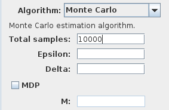
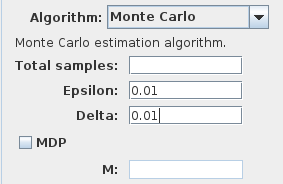

Monte Carlo methods
===================

Monte Carlo methods allows to estimate the probability
to satisfy a requirement. They can be used with confidence bounds like the Chernoff bound.

Monte Carlo methods can also be used to compute the average value of a reward property.
In PLASMA Lab requirements may return float value that correspond to the result of some
computation along the trace, like a cost or a reward.
However, note that if these values or not bounded no confidence can be associated to the result estimated 
with Monte Carlo.

To run the Monte Carlo algorithm, either set the number of simulations:

- **Total samples** the number of simulations to run.

Otherwise the number of simulations can be determined using the Chernoff-Hoeffding bound based on two parameters:

- **Epsilon** the error margin.
- **Delta** the confidence bound.

**MDP** and **M** are used for :doc:`Markov Decision Processes <mdp>`.
