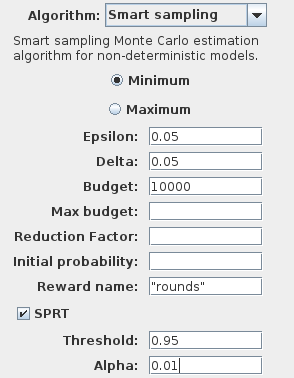
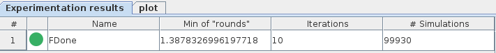
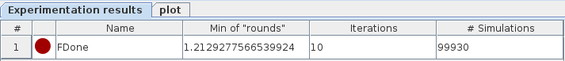

Reward estimation for MDPs
==========================

In addition to estimating minimum and maximum probabilities, PLASMA Lab implements an algorithm to estimate minimum and maximum expected reward,
as defined by the rewards properties described below.

Types of reward
^^^^^^^^^^^^^^^

Rewards or costs are additional variables assigned to states or transitions.
The RML language uses a specific rewards construction described below and on the PRISM website::
  
  rewards rewardName  
    
    guard1 : value1;
    [] guard2: value2;
    [channel] guard3 : value3;
    
  endrewards

This construction associates the following values to the reward:

1. The first command defines a state reward that assigns the *value1* to each state of the model that satisfies *guard1*.
2. The second command defines a transition reward that assigns the *value2* to each non synchronized transition that satisfies *guard2*.
3. The third command also defines a transition reward but it assigns the *value3* only to the transitions labeled with *channel* and that satisfy *guard3*.

Three types of reward properties define the value of the reward associated to a path that will be used by the algorithm:

- **Reachability rewards:** The reward is associated to a BLTL property and the value of the reward for a path is the cumulative value (the sum of state rewards and transition rewards) along the path up to the state that satisfies the property (or the last one if the property is not satisfied). Note that this is different from PRISM that only computes reachability rewards for LTL properties that are always satisfied (otherwise the reward is infinite).
- **Cumulative rewards:** The reward of a path is the cumulative reward up to time **T**. This type of reward is easily encoded with PLASMA Lab using a reachability reward with a BLTL property like ``G<=# T true``.
- **Instantaneous rewards:** The reward of a path is the state reward of the state at time **T**. To specify this reward in PLASMA Lab we use the name ``rewardName[I]`` instead of *rewardName* and a BLTL property like ``G<=# T true`` to encode the timing.

Smart reward estimation algorithm
^^^^^^^^^^^^^^^^^^^^^^^^^^^^^^^^^

The algorithm is somehow similar to the probability estimation algorithm. However the set of schedulers is directly initialized at the begin
of the algorithm using all the simulation budget, and the first iteration performs one simulation for each scheduler.
For each scheduler the algorithm evaluates the expected reward at the time the BLTL property is satisfied.
Then after each iteration the best schedulers are kept and the number of simulations is increased according to the reduction factor.

For reachability rewards an additional computation is performed. Since the algorithm only consider bounded properties,
we evaluate the hypothesis that the probability to satisfy the BLTL is at least greater than a given **Threshold**.
This is computed using an **SPRT** test with a confidence parameter **Alpha**. If the test is satisfied the result
will display the property indicator in green. Otherwise it stays red.

Hypothesis accepted by the SPRT test:

Hypothesis rejected by the SPRT test:

