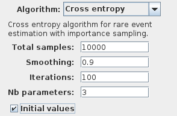

Importance sampling
===================

Importance sampling is another technique to improve rare events simulation.
It works by using an alternate probability distribution in the model, such that
rare properties will appear more often in the simulations.
SMC algorithms take into account the likelihood ratio of the traces
generated with this new probability distribution in order to compute an unbiased result.

RML with importance sampling
^^^^^^^^^^^^^^^^^^^^^^^^^^^^

From version 1.3.4 of PLASMA Lab allows to add sampling parameters in the RML language.

**Model type**

Importance sampling uses a different simulator in order to simulate the model according to the sampling parameters and to compute the
modified rate of each run. This simulator is enabled by using the keyword *sampling* after the model type. Therefore the following model
types are available for importance sampling:

- ``dtmc sampling``
- ``ctmc sampling``
- ``mdp sampling``
- ``mdp shd sampling``
- ``mdp sml sampling``

**Sampling parameters**

Sampling parameters are declared with ``{ expr }`` before the normal rate of an action.
This new rate multiply the normal rate of the action.

**Algorithms**

Importance sampling is implemented with the following algorithms:

- Monte Carlo
- Chernoff
- Chernoff ND
- Cross entropy

Cross entropy algorithm
^^^^^^^^^^^^^^^^^^^^^^^

The choice of a sampling distribution is critical to get a good estimate with the importance sampling technique.
The cross entropy technique allows to discover an optimal distribution using an iterative process:

- Starting from an initial distribution, the algorithm computes new values for the parameters by counting the number of times each command is used in successful traces.
- The algorithm performs this process during several iterations, until the parameters have reached a sufficient precision.

PLASMA Lab cross entropy algorithm assumes that there exists three special categories of variables in the model:

- A set of variables that corresponds to the sampling parameters. They are named **lambda1**, **lambda2**, **lambda3**, etc.
- A set of variables that counts the occurrence of a transition associated to a sampling parameter. They are named **nb_lambda1**, **nb_lambda2**, **nb_lambda3**, etc.
- A set of variables that defines the normal rate of the transitions. They are named **"rate_lambda1"**, **"rate_lambda2"**, **"rate_lambda3"**, etc.

Currently only the RML language enable importance sampling. To use cross entropy with RML in PLASMA Lab the user first needs to edit his model such that:

- Each action is associated to a sampling parameter named **lambda1**, **lambda2**, **lambda3**,  etc.
- Sampling parameters are declared globally as constant, possibly with an initial value.
- For each sampling parameter, there exists a count variable declared globally as an integer, initialized at 0, and named **nb_lambda1**, **nb_lambda2**, **nb_lambda3**,  etc.
- Each action increments its count variable if it is taken. For instance the following command::
  
  [] state1 >= 2 -> mu : (state1'=0);

 is transformed with sampling parameters into::
  
  [] state1 >= 2 -> {lambda2} mu : (state1'=0) & (nb_lambda2'=nb_lambda2+1);

- For each sampling parameter there exists a label named **"rate_lambda1"**, **"rate_lambda2"**, **"rate_lambda3"**, etc, that defines the normal rate of the action. For instance, in the above command, the rate of the action is ``label "rate_lambda2" = mu;``

PLASMA Lab implements the cross entropy algorithm with the following parameters:

- **Total samples** is the number of simulations at each iteration.
- **Smoothing factor** is a parameter between [0,1] use to decrease the probability of a command the has never been used in the previous iteration. This is less abrupt than setting the sampling parameter to zero.
- **Maximum iterations** is the number of iterations of cross entropy to perform.
- **Number of parameters** is the number of sampling parameters in the model.
- **Initial values** is an option that uses a uniform simulator at the first iteration of the algorithm in order to guess the initial distribution of the parameters.

