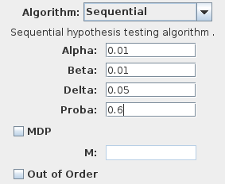
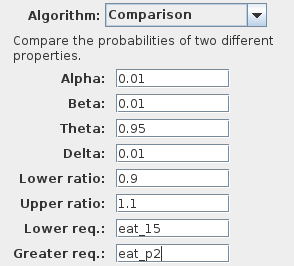

Hypothesis testing
==================

Sequential Probability Ratio Test (SPRT)
----------------------------------------

The Sequential Probability Ratio Test (SPRT) is used check if the probability to satisfy a property is above or below to a given threshold. It needs four parameters :

- **Alpha** the false positives probability.
- **Beta** the false negatives probability.
- **Delta** the indifference region around proba.
- **Proba** the probability.
- MDP and M are used for :doc:`Markov Decision Processes <mdp>`

Comparison algorithm
--------------------

The comparison algorithm is used to compare the probabilities of two properties (whether one is greater than the other).
Therefore, contrary to all other algorithms, it requires to select two requirements from the requirements list.
The algorithm is based on an hypothesis test for the odds ratio of the two probabilities. It checks whether this ratio is lower or greater than one (with an indifference region).
The algorithm also performs an additional hypothesis test to determine if the two probabilities are equal.
Then it is configured with the following parameters:

- **Alpha** the false positives probability.
- **Beta** the false negatives probability.
- **Theta** the minimum probability needed to assess that the two probabilites are equal.
- **Delta** the indifference region around theta.
- **Lower ratio** the lower value for the odds ratio
- **Greater ratio** the greater value for the odds ratio
- **Lower req.** the name of the lower requirement
- **Greater req.** the name of the greater requirement