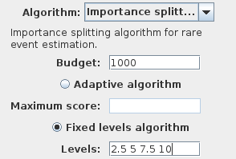
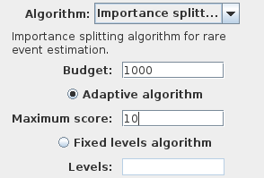

Importance splitting
====================

This algorithm allows to estimate the probability of rare events (with very low probability)
more efficiently than the classical Chernoff-Bound. The idea is to decompose the verification
of property :math:`\phi` into several properties such that :math:`\phi_1 \Rightarrow \phi_2 \Rightarrow \phi_3 \Rightarrow \dots \Rightarrow \phi_n=\phi`.
These properties defined a set of levels that a trace need to satisfy before :math:`\phi`  is satisfied.

RML observers
^^^^^^^^^^^^^

The importance splitting algorithm only works with a special type of requirement from the observer plugin included in the RML plugin.
An observer requirement encodes the automata that determines the value of a BLTL property along a trace.
If this property can be decomposed the automata computes a score that determines which level has been reached by the trace.

Syntax
******

An observer is similar to a module from the RML language with the following particularities:

- An observer is declared with the construction ``observer ... endobserver`` in place of ``module ... endmodule``.
- An observer can declare local variables.
- An observer can reference in its expressions external variables from the model.
- An observer can only have non synchronized commands.

An observer requirement can have several observers, as well as constants, formulas, and global variables.
It must contain one variable **score** and one variable **decided**.

As example this observer is used in the simple chain model::

  observer chainObserver
    score : double init 0;
    decided : bool init false;
    
    [] s != 11 & score < s -> (score’=score+1);
    [] s>=10 -> (decided’=true);
  endobserver

Semantics
*********

The observers are executed sequentially after each simulation step of the model:

- Each observer in the requirement is executed once in sequential order from top to bottom of the requirement file.
- Each enabled command from an observer is executed once, again sequentially in the order of declaration from top to bottom.
- The observers and the model are simulated as long as the variable decided is false. Therefore the observers must encode a temporal bound and update the variable decided once the temporal bound is exceeded.
- The variable score is used by the algorithm to determine which level the current trace has reached.

From BLTL to observers
**********************

PLASMA Lab include a tool that can automatically translate a BLTL property into an observer requirement.
This functionality is available with a right click on the name of the BLTL property in the *Project Explorer*.
The property can have limited nesting of temporal operators. It produces an observer requirement with several observers
(one for each temporal operator). The user must then edit this requirement to compute an adequate score.

Importance Splitting Algorithms
^^^^^^^^^^^^^^^^^^^^^^^^^^^^^^^

The principle is to specify a fixed budget that is the number of traces executed at each level. 
The traces that reached the next level are kept. The ones that failed are restarted from a successful trace.
The algorithms then compute a series of conditional probabilities to reach a level n from a level n+1
and the final result is the product of these conditional probabilities.

Two different importance splitting algorithms are implemented in PLASMA Lab:

- **Fixed levels algorithm:** The levels are specified by the user that inputs a series of decimal values separated by spaces. These values correspond to the score of the different levels. The algorithm simulates the traces up to a state that satisfies the next level or up to the time bound if the trace is not successful. The last state of the sucessful traces correspond to the initial states for the simulations up to the next level.

- **Adaptive algorithm:** The number of levels is not known a priori. The user input the maximum score of the trace, that is reached when the trace satisfies the BLTL property encoded by the observers. The algorithm simulate all the traces up to the time bound. The traces with the minimum score are restarted at the next next using an initial state of a ''better'' trace. This maximizes the number of levels and improve the variance of the estimator.

