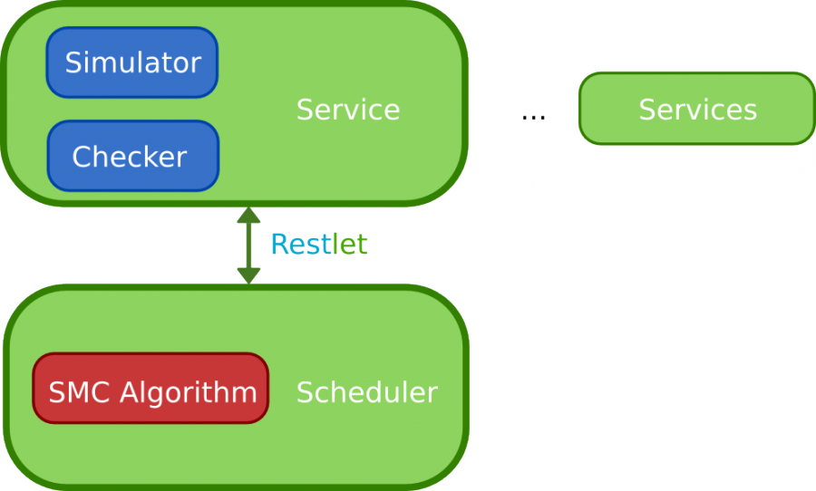
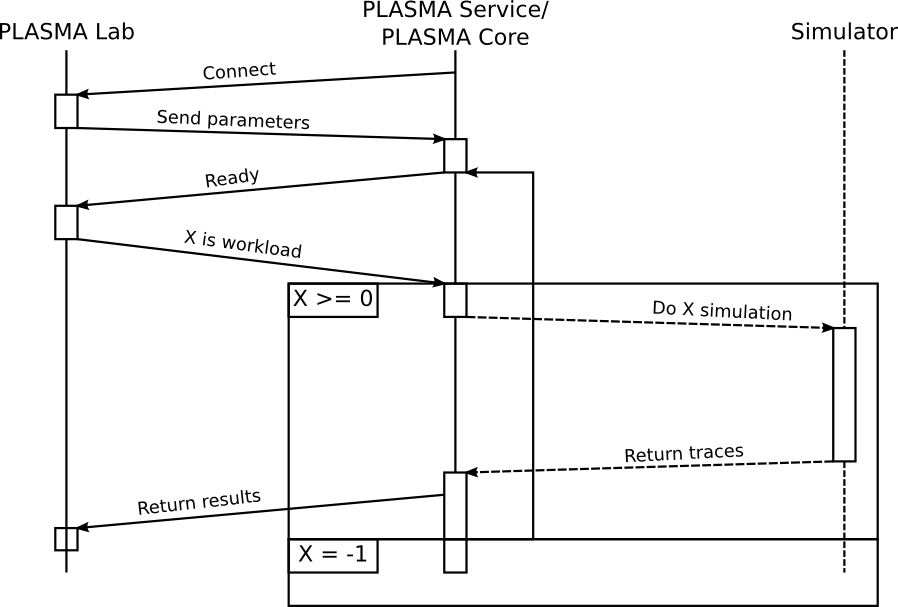
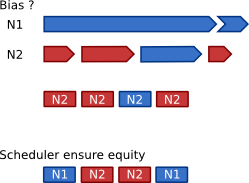

Distributed algorithms
======================

PLASMA Lab can run experiments in a distributed mode.
This mode uses a second software, called **PLASMA Lab Service**,
that is a small PLASMA Lab client
deployed on a distant computer.

    
In distributed mode the *Simulator* and the *Checker* components are deported to the *Service*, while the
*Algorithm* is split between a **Scheduler**, running in PLASMA Lab, and a
**Worker** running in the *Service*. The communication between the *Scheduler* and the *Worker* uses **RestLet**.

Sequence diagram 
^^^^^^^^^^^^^^^^

Sequence diagram of a session between PLASMA Lab and PLASMA Service:

Step 0: Publishing a Restlet service
------------------------------------

    PLASMA Lab: I need help to run this experiment.

When launching a distributed experimentation, PLASMA Lab publishes an
interface on a Restlet Server (this server being part of the PLASMA Lab
code). Publishing this interface will allow other programs to retrieve
the interface and use its functions.

We call Client a PLASMA Service instance and the Server the PLASMA Lab
instance who published the interface.

Step 1: Connecting to PLASMA Lab
--------------------------------

    PLASMA Service: I can help you.

    PLASMA Lab: Ok, here are the experiment parameters.

When a client connects itself to the server, it retrieves the RMI
Interface and it calls the connect function. This function returns the
experiment parameters containing the model and the list of requirements to check.
These parameters also contains an ID to allow clients to identify themselves.

Step 2: Getting a share of the work
-----------------------------------

    PLASMA Service: I am ready to work.

    PLASMA Lab: Run K simulation and check the properties.

The client then calls the service ready function. This function will
inform the server that this client is ready and will return an integer
K. This integer represents the number of traces that the client has to
generate. K can take several values:

-  K = -1 means that the work is done, the client can disconnect.
-  K = 0 tells the client to wait. This is used to wait for more client
   to connect before launching the simulation.
-  K > 0 tells the client to generate K execution traces and check the
   properties on these traces.

Step 3: Returning the results
-----------------------------

    PLASMA Service: Here are my results.

The client calls the work done function. This function sends the results
to the server. The client then return to step 2.

Scheduler
^^^^^^^^^

**Avoiding bias:** Depending on the requirement, a negative trace -- *on which a property does not hold* -- can be faster
to check than a positive trace -- *you have to read the whole trace to see that it is a positive trace* --,
or the contrary. In both cases, a bias can form on a distributed SMC algorithm.

Our scheduler keeps the order of each task assigned to a client and only
takes results into account on this order. This ensure that a task
launched at *time t* will be taken into account before any task launched
at a *time > t*.

Moreover, this scheduler ensures that a faster client will be given more
work and contribute more to the overall effort. We have also implemented some
ideas coming from the Slow-Start algorithm used in TCP to reduce the
client-server communications.

A *Scheduler* implements the same interface as a local algorithm:

-  *fr.inria.plasmalab.algorithm.InterfaceAlgorithmScheduler*

The *fr.inria.plasmalab.distributed.algorithm.AbstractScheduler* class provides a generic implementation of several methods
used to create a distributed algorithm:

- The *setServices* method set the parameters for the distributed experiment (port, number of threads, size of the batch, factories). 

- The *postErrorMessage* method posts an error message to the experimentation manager and abort experimentation.

- The *putResult* method adds a result to the *TaskScheduler*.

- The *registerNewNode* method registers a new node on the *NodeTaskManager*.

- The *schedule* method sends an order to a node requesting one. This can either be a BATCH order, a WAIT order or a TERMINATE order.

- The *initializeServer* method performs a generic initialization of the scheduler. It should be called at the beginning of the *run* method.

- The *getNextResult* method waits for a result and removes it from the nodeTaskManager. If a stop order is received the method returns null.

- The *reassignTaskTo* method reassigns an unassigned task to a node. If the unassigned task points to a null order,
or if there is no assigned task, it returns null.

Worker
^^^^^^

Each of our distributed implementation are based on a similar protocol
described in the earlier sequence diagram. However this protocol only
depends on the Scheduler-Worker implementation and could be changed
depending on particular needs. The only constraints being that
the **connect** method of the *Worker* will be called to initiate the
communication with the *Scheduler*.

A *Worker* implements:

-  *fr.inria.plasmalab.algorithm.InterfaceAlgorithmWorker*

The *fr.inria.plasmalab.algorithm.InterfaceAlgorithmWorker.AbstractWorker* class provides 
a generic implementation of several methods used by workers:

- The *processTerminateOrder* method processes a TERMINATE order (by doing nothing).

- The *processWaitOrder* method processes a WAIT order: it gets the waiting time parameters from the order and it then waits for this duration.

- The *start* method starts the worker and processes the orders.

Order
^^^^^

Whenever a *Worker* tells the *Scheduler* it is ready to work, the
*Scheduler* will transmit an **Order**. This *Order* indicates for instance the number of simulation -- **a batch** -- to run and check.
Other types of *Order* can be transmitted:

-  **Batch** - Indicate the number of simulations to run and check
-  **Wait** - Indicate to wait for a given time
-  **Terminate** - Indicate to disconnect and close the Service

Task Manager
^^^^^^^^^^^^

Each *Order* is associated to a unique identifier, a **Task**.
A *Task* will then be assigned to a *Worker*. These associations are handled by the **NodeTaskManager**.

As explained in the bias section, results must be taken into account in
the same order the corresponding task were assigned. This is done by the **TaskScheduler**.

Heartbeat
^^^^^^^^^

In case a *Worker* disconnects, or another error happens, the *Task* is
re-affected by the *NodeTaskManager* to the next available *Worker*.

A **Heartbeat** system allows the *NodeTaskManager* to monitor the
liveness of *Worker*. Using a UDP socket, *Worker* must regularly
transmit heartbeat packets. If these transmissions cease, *Worker* are
declared disconnected. The classes involved in the *Heartbeat* system are
found in the *fr.inria.plasmalab.distributed.algorithm.heartbeat*
package.

RestLet
^^^^^^^

Our distributed algorithms use RestLet to handle communication between
Scheduler and Workers. RestLet is a Restful framework API for Java.

More details on RestLet API can be found at `<http://restlet.com/>`__ or
around the Web.

