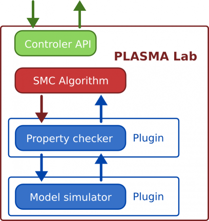

Controller
==========

The Controller project -- *fr.inria.plasmalab.controler* -- exposes the PLASMA Lab API.
This layer is used to launch and control the execution of a
PLASMA Lab experimentation. The PLASMA Lab API is effectively used by
the PLASMA Lab GUI.

Initialization
^^^^^^^^^^^^^^

The *Controler* class is a singleton class created by calling the
*createControler* function. Path to the configuration file and java
arguments are passed to the initialization function.

According to the configuration file, the Controller will configure the
log4j module and load required PLASMA Lab plugins.

PluginLoader
^^^^^^^^^^^^

Loading PLASMA Lab plugins is done by the *PluginLoader* class.
Most SMC algorithms are loaded statically by the PluginLoader as they are included in the libs directory of PLASMA Lab distribution.
Other plugins (models, requirements and additional algorithms) are loaded from the plugin sources specified in the configuration.

Experimentation Manager
^^^^^^^^^^^^^^^^^^^^^^^

The *ExperimentationManager* class launches and monitors the execution of an SMC Algorithm.
The experimentation manager can be accessed trough the Controller.

A new experimentation is initialized by calling the *setupAnExperiment* method.
The experimentation is monitored through the *ExperimentationListner* implementation.
However the manager only transfers notifications to registered listener. The process calling the
Controller API must give a reference to an object implementing the
*ExperimentationListener* interface.

Simulation Manager
^^^^^^^^^^^^^^^^^^

The *SimulationManager* follows the same purpose as the
*ExperimentationManager* but for the simulation mode. As it is only
passing calls to simulation functions of the selected model its use may
be avoidable.

