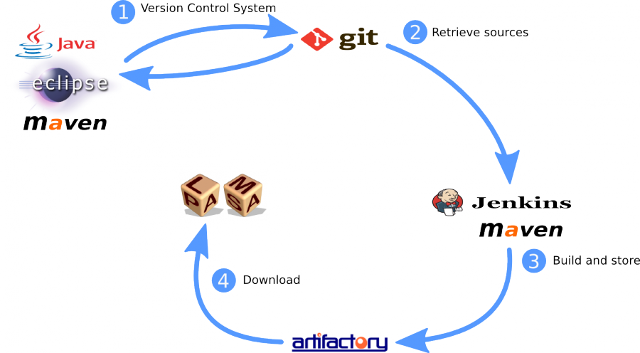

Continuous integration
======================

The PLASMA Lab project uses Continuous Integration practice. After an
overview on this practice and the tool chain we use, this chapter
details the procedure for publishing a new version of PLASMA Lab.

Git
^^^

Git is our Version Control System. The Git repository is hosted on
gforge.inria.fr and a link to the PLASMA Lab Git can be retrieved by
joining the PLASMA Lab Gforge project.

-  http://git-scm.com/
-  http://gforge.inria.fr/

Maven
^^^^^

Maven handles project dependencies and build configuration.

-  http://maven.apache.org/

Jenkins
^^^^^^^

Jenkins is an Automated Continuous Integration server. The server is
hosted at ci.inria.fr. Jenkins is used to launch automated SNAPSHOT
build every night as well as manual release build. Executables are the
deployed to Artifactory.

-  http://jenkins-ci.org/
-  https://ci.inria.fr/plasmalab/
-  https://wiki.inria.fr/ciportal/

From version 1.4.4 Jenkins is not used in the Continuous Integration process due to 
uncompatibilities between Jenkins and Maven Artifactory.

Artifactory
^^^^^^^^^^^

Artifactory is an open-source repository manager. Build are stored on it
and can be downloaded by PLASMA Lab users. Artifactory is also hosted by
INRIA.

-  http://maven.inria.fr/artifactory

Release Procedure (from version 1.4.4)
^^^^^^^^^^^^^^^^^^^^^^^^^^^^^^^^^^^^^^

The procedure is run from the directory ``fr.inria.plasmalab.root``. All links in the procedure are relative to this directory.

1 Prepare the release 
---------------------

Run the script ``prepare.sh`` with the new release version and the next snapshot version:

- The script updates the ``.bat`` scripts and the ``README.md`` with the new release version and it commit these changes.
- It then runs the maven release plugin (``mvn release:prepare``) to update the pom.xml:

    * It updates the pom.xml files to the new release version.
    * It creates a git-tag whose name is the release version.
    * Then it updates again the pom.xml files to the new development version.
    * It commits the changes.
- Afterwards, the script updates again the ``.bat`` scripts and the ``README.md`` with the snapshot version.
- It commits the changes and pushes to the git repository.
    
2 Build and deploy
------------------ 

Retrieve the tagged release with ``git checkout release-version`` and then run the script ``deploy.sh``:

- This runs maven with the assembly, javadoc and deploy plugins (``mvn clean package assembly:assembly javadoc:javadoc deploy:deploy``):
    
    * It compiles the ``.jar`` artifacts for all the projects (listed in the ``pom.xml`` file) .
    * It compiles distribution bundles with the assembly plugin (using the configuration in ``src/assembly/assembly.xml``) in ``target``.
    * It compiles the javadoc in ``target/site``.
    * It deploys the artifacts to ``maven.inria.fr/artifactory/plasmalab-public-release``.

- It deploys the distribution bundles to Gforge.
- It deploys the javadoc to Gforge.

Retrieve the head of the repository ``git checkout master`` and re-run the script ``deploy.sh`` to deploy the snapshot version.
    
3 Update the documentation
--------------------------

- Update the content related to the new version.
- Check links in the documentation that may refer to the old version.
- Update PLASMA Lab's version number in ``conf.py``.
- Compile with ``make html`` and ``make latexpdf``.
- Update the pages ``index.php`` and ``manuel.php`` with the new version.
- Deploy: run the script ``deploy.py`` to show which commands to launch. The commands will create a new directory on the gforge online repository and upload in it the documentation (the builds).

4 Update "external" content
---------------------------

This concerns content that is not automatically updated:

- Update Plasma2Simulink.
- Update the tutorials if needed.
- Update the PTA plugin if needed.

5 Update the website
--------------------

- Update the version number and the content of the website (if needed). The documentation links are now relative to php files and don't need to refer to the version.
- Update the download links.
- Post a news.
- Send a mail to the mailing lists (``plasma-lab-news@lists.gforge.inria.fr`` and ``plasma-lab-developers@lists.gforge.inria.fr``).

Snapshot Release Procedure (from version 1.4.4)
^^^^^^^^^^^^^^^^^^^^^^^^^^^^^^^^^^^^^^^^^^^^^^^

Run the ``deploy.sh`` script from ``fr.inria.plasmalab.root``.

