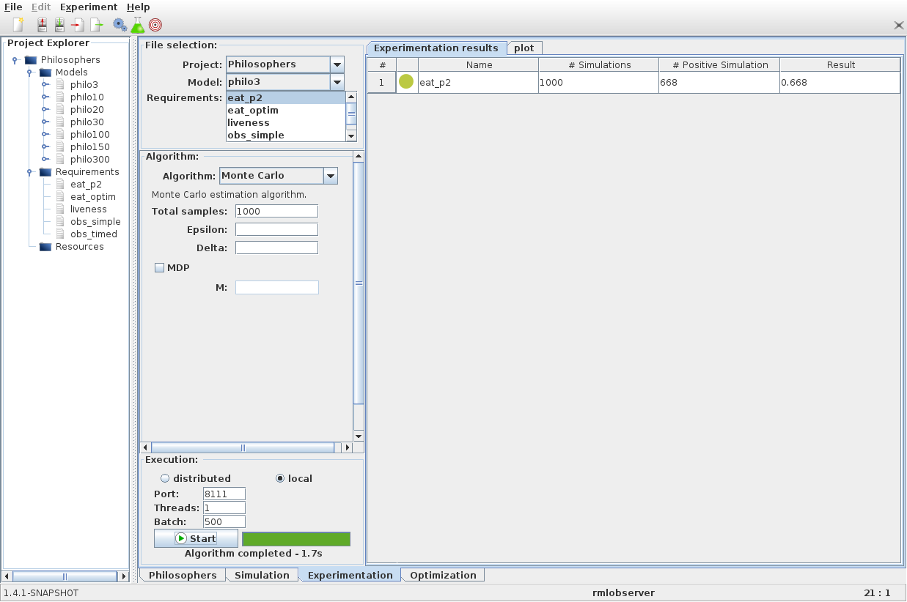

Experimentation mode
====================

The **Experimentation** panel is made of 4 different areas:

- A *File selection* panel
- An *Algorithm* panel
- An *Execution* panel
- An *Experimentation results* panel

As previously, we select the project and the model from the *File selection* panel
as well as requirements to check (at least one). We choose an SMC algorithm in the *Algorithm* panel
and configure its parameters. For this tutorial lets choose the Monte Carlo algorithm with a
*Total samples* parameter of 1000 simulations.
Finally we click on the *Start* button at the bottom of the interface.
Once the 1000 simulations have been computed, results show up in the
result panel.

We can also select the *Plot* panel to have a better understanding of our
results by drawing plots.

The next step of the tutorial presents the :doc:`optimisation panel <optimisation>`.

