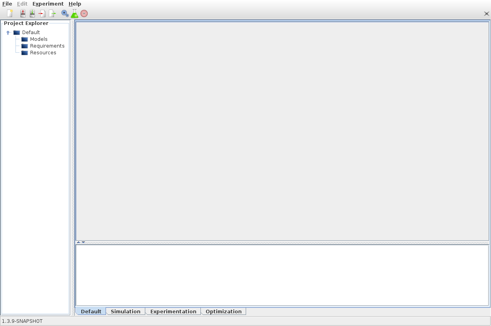
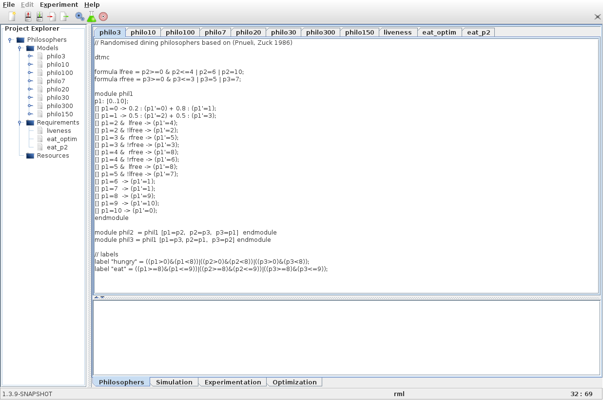

Open and Edit a project
=======================

PLASMA Lab Graphical User Interface (GUI) is composed of several
elements:

-  A **main tabbed panel**, that displays projects and experimentation/simulation panels.
-  A **project explorer**, that shows the tree structure of opened projects.

Start the GUI :

.. code::

    # \*nix - from the command line
    ./plasmagui.sh launch 

    # windows - double click on
    plasmagui.bat

This is the windows you will see after launch:

We will have a later look at the experimentation and simulation panels.
Let's focus on the project panel. In this panel we can edit two types of data.
**Models** that describe our system and **Requirements**
that we want to verify.

Download this `sample project <http://plasma-lab.gforge.inria.fr/plasma_lab_examples/DTMC/Philosophers.plasma>`__
and open it in PLASMA Lab. This can be done using the File menu. You can also find more examples `here <https://project.inria.fr/plasma-lab/Examples/>`__.

You can now edit your model and properties. You could also create new
properties and models or import them using the File menu. 
**Be sure to select the right type when creating a new data or importing one**.
If you want to rename a file you can do so by right-clicking on the item you want to rename in the project explorer.
At the bottom of the edit panel you can find **error messages** that concern the properties and models
you are editing as well as an indication showing **the type of the selected data**.

The next page shows you how to test your model in the :doc:`simulation panel <simulation_mode>`.

PLASMA Projects
~~~~~~~~~~~~~~~

Project files (extension .plasma) are XML files that allows to build a collection of models, requirements and possibly other text resources.
Legacy project files are self-contained: all the models or requirements are included in the XML file as a text field.

From version 1.4.2 project files can also be links to existing files. In that case saving the project in PLASMA Lab GUI will save the content 
of the models and requirements on the files given in the project file. When creating a new project, if a content is added with the **New** menu
the content will be saved in the XML file. If a content is imported with the **Import** menu from an existing file, the content will always be saved in that
file, and only a path to the file will be saved in the XML file. Note that a project can contain at the same time content from the XML file and content 
from a file.

