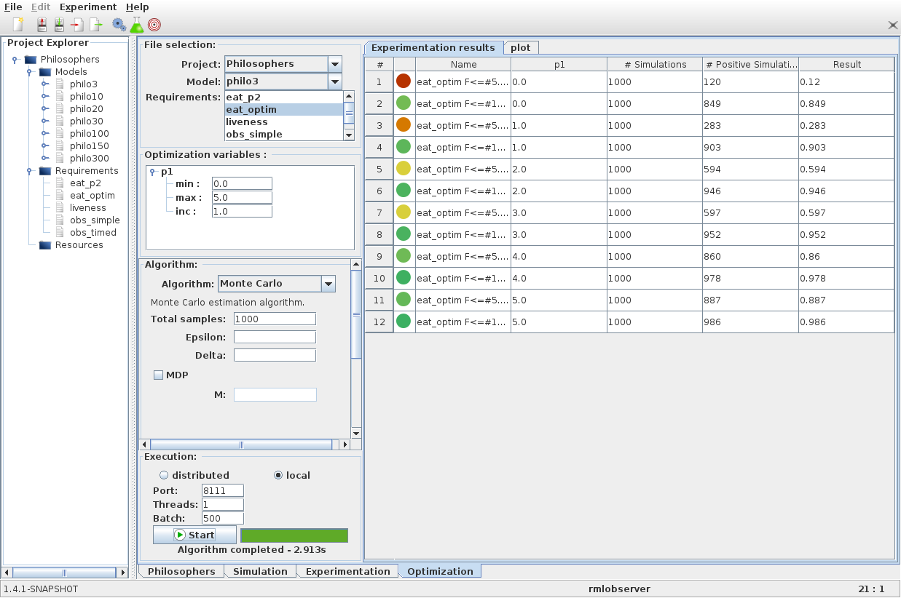

Optimization mode
=================

The **Optimization** panel extends the experimentation mode by allowing a
user to define a set of initial states. When launching an experiment
each initial states will be checked as a separate experiment.

Defining an optimization variable depends on the model or property
language. It is possible to define optimization variables in a property,
which will modify the associated model.

Compared to the *Experimentation* panel, the *Optimization* panel has an additional panel 
to modify optimization variables before running an experiment.

