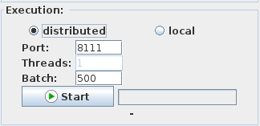
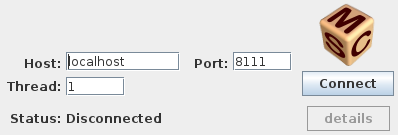

Distributed experiments
=======================

PLASMA Lab implements parallel SMC algorithms that allows to massively distribute the simulations.
In distributed mode, PLASMA Lab GUI acts as a server that controls the SMC experiment
while a PLASMA LAB client is launched on a distant computer to perform simulations.
The server requests simulations from the clients and then wait for the results. 
Finally it aggregates the different results and it either shows the final result in the gUI or
it requests more simulations if needed.

Setup a PLASMA Lab distributed experiment
^^^^^^^^^^^^^^^^^^^^^^^^^^^^^^^^^^^^^^^^^

When setting our experiment in the previous tutorial we didn't used the *Execution* panel that is set to local by default.
This panel allows to configure 3 different executions mode:

- A local single thread mode that is used by default when the selector is on local and the number of threads is equal to 1.
- A local multi-threaded mode when the selector is on local and the number of threads is at least 2.
- A distributed mode that waits for clients to connect to the experiment.

In the last two modes, the number of **Batch** defines the maximum number of simulations 
that will be performed in a row by a client.

In distributed mode we can configure the port on which PLASMA Lab is listening.

We now select the distributed mode and then click on the *Start* button.
This will initialize the server and start the algorithm scheduler.

Setup PLASMA Service
^^^^^^^^^^^^^^^^^^^^

In order to run a distributed experiment we must connect clients to the server in order to perform the simulations.
PLASMA Service is a small GUI that starts a client:

.. code::

    # \*nix - from the command line
    ./plasmagui.sh service

    # windows - double click on
    plasmaservice.bat

    
PLASMA Service lets you define the host address and the port on which PLASMA Lab
is listening. You can also set the number of threads that you want to run on this instance of PLASMA Service.

Once PLASMA Service is setup we click on the connect button. PLASMA
Service status now switch to running. Once our experiment is completed,
PLASMA Service disconnect itself.

Alternatively you can run PLASMA Service in a command line interface. This might be
useful if you intend to run it on a distant machine.
