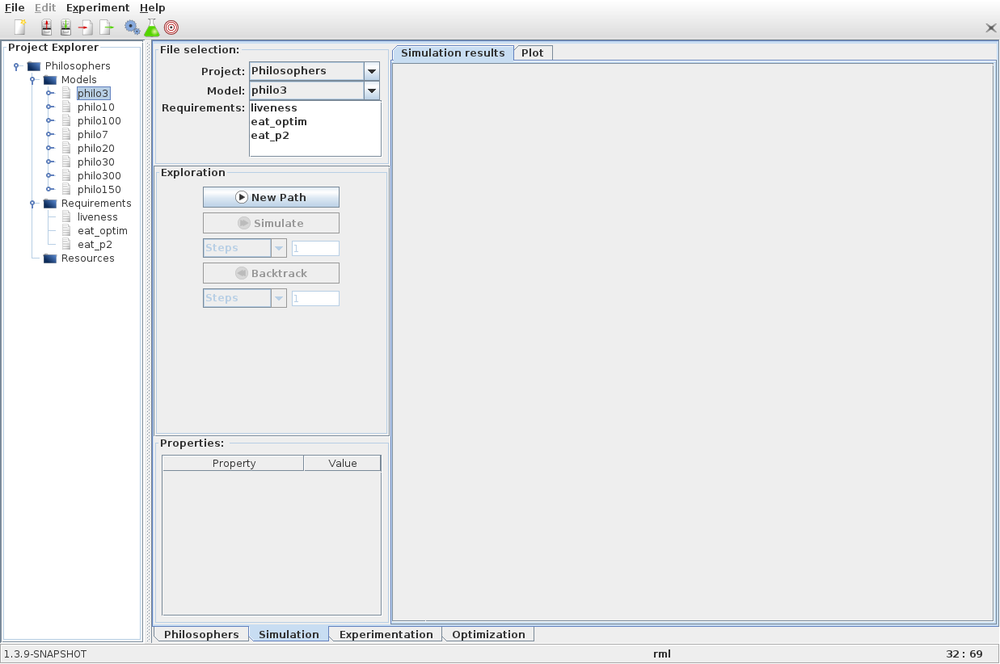

Simulation mode
===============

The **Simulation** panel allows to generate one trace step-by-step, and to look at the values of the
model's variables and the properties along this trace. It is made of four different areas:

-  A *File selection* panel
-  An *Exploration control* panel
-  A *Properties* panel
-  A *Simulation results* panel

In order to simulate our model we select the project and the model
from the *File selection* panel. We can also select a property to check during
the simulation, but this is not mandatory.

To start a new trace we use the **New path** button in the simulation
control panel. The initial state of our model appears in the simulation
result panel. We can then **Simulate** the model or **Backtrack** using
the corresponding buttons.

When the simulation progresses or when we select a specific state,
values are updated in the property panel.

.. image:: ../images/plasma_simu_trace.png

Alternatively to the *Simulation results* panel, we can use the *Plot* panel.
This panel allow us to draw **2D or 3D plots**. To draw a 2D plot showing
the evolution of p1 against time select the blank value in the X combo
box (the empty identifier represents the discrete time) and
p1 in the Y combo box.

Once we have tested our model and properties, we can go to the
:doc:`experimentation panel <experimentation_mode>` to use PLASMA Lab SMC algorithms.
This is the next step of our tutorial.
