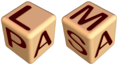

Plasma Lab
============

|image0|

PLASMA Lab is a compact, efficient and flexible platform for statistical
model checking of stochastic models. PLASMA Lab demonstrates the following advances:

- Use your own simulator and  checker via our plugin system.
- Build your software around Plasma Lab using our API.
- Prism (Reactives Modules Language-RML) and Biological languages supported.
- Matlab, LLVM, SytemC plugins.
- Distributed architecture. Whether you plan to use several computers on a local area network or a grid, you can run PLASMA Lab in an easy way.
- Fast algorithms.
- Efficient data structure, low memory consumption.
- Developed with Java for compatibility.

PLASMA Lab, is being integrated into the DALi, ACANTO and DANSE project platforms.

How to cite PLASMA Lab
~~~~~~~~~~~~~~~~~~~~~~

-  **Statistical Model Checking of Simulink Models with Plasma Lab**.
   Axel Legay, Louis-Marie Traonouez, FTSCS 2015: 259-264
-  **PLASMA-lab: A Flexible, Distributable Statistical Model Checking Library**.
   Benoît Boyer, Kevin Corre, Axel Legay, Sean Sedwards, QEST 2013: 160-164
-  **A Platform for High Performance Statistical Model Checking – PLASMA**.
   Cyrille Jégourel, Axel Legay, Sean Sedwards, TACAS 2012: 498-503

People
~~~~~~

-  `LEGAY Axel <http://people.irisa.fr/Axel.Legay/>`__ – Team leader – axel.legay[-at-]inria.fr

-  `TRAONOUEZ Louis-Marie <http://people.rennes.inria.fr/Louis-Marie.Traonouez/>`__ – Developer – louis-marie.traonouez[-at-]inria.fr

-  `QUILBEUF Jean <https://people.irisa.fr/Jean.Quilbeuf/>`__ – Developer – jean.quilbeuf[-at-]inria.fr

Former members
^^^^^^^^^^^^^^

-  `BOYER Benoit <http://people.rennes.inria.fr/Benoit.Boyer/>`__ – Developer

-  `CORRE Kevin <https://github.com/Sparika/>`__ – Developer

-  `JEGOUREL Cyrille <http://people.irisa.fr/Cyrille.Jegourel/>`__ – Contributor

-  NGO Van-Chan – Developer

-  `SEDWARDS Sean <http://people.irisa.fr/Sean.Sedwards/>`__ – Developer – sean.sedwards[-at-]inria.fr

-  `SIMONIN Matthieu <http://people.irisa.fr/Matthieu.Simonin/>`__ – Developer – matthieu.simonin[-at-]inria.fr

--------------

Download
~~~~~~~~

PLASMA Lab is developed with Java 7. Previous versions may present issues and are not supported.
The main distribution bundles for the latest version |plasmalab_version| of PLASMA Lab can be downloaded on the download page of the website:

    | https://project.inria.fr/plasma-lab/download/

These bundles include PLASMA Lab GUI and PLASMA Lab CLI, the Graphical and Command Line Interfaces,
all the libraries needed to run PLASMA Lab's SMC Algorithms, including the libraries to run distributed experiments,
and a selection of plugins. Older and experimental versions, specific plugins can also be downloaded from the website.

Download and extract one of these files and run them in a terminal you should
observe this structure :

.. code:: 

    .
    +-- configs             # contains the configuration files
    +-- demos               # contains some examples
    +-- libs                # all the libs needed by plasma to run
    +-- plugins             # contains the plugins (you can add your own here)
    +-- plasmacli.bat       # (windows) starts the cli
    +-- plasmacli.sh        # (\*nix) starts the cli
    +-- plasmagui.bat       # (windows) starts the gui
    +-- plasmagui.sh        # (\*nix) starts the gui (plasmalab or service)
    +-- plasmaservice.bat   # (windows) starts the service gui
    +-- README.md

