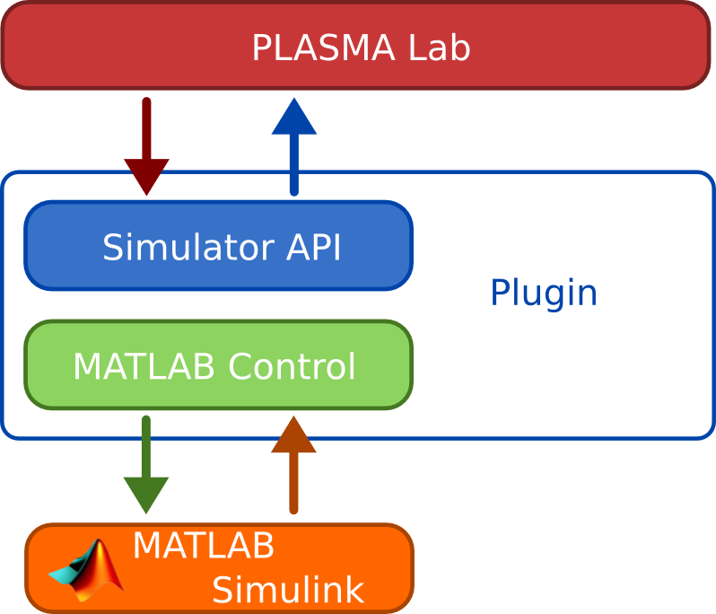
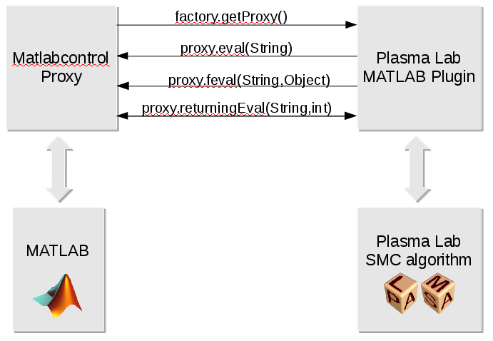
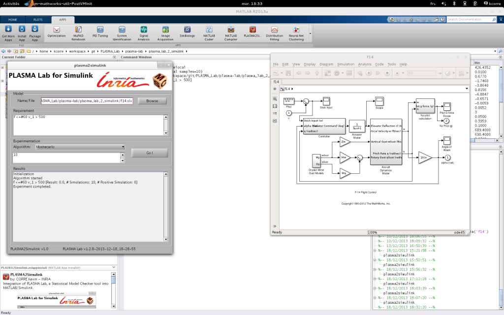

MATLAB/Simulink
===============

In order to use SMC methods on wider and more complex models, we worked
on interfacing PLASMA Lab with MATLAB/Simulink.

We first describes how we implemented the interface between PLASMA Lab
and Simulink, and give a short explanation on how to use the Simulink plugin in PLASMA Lab.
Then, in the second section, we detail the PLASMA2Simulink App than can be installed in MATLAB, how to install it and how to use it.

Simulink plugin for PLASMA Lab
------------------------------

The Simulink PLASMA Lab plugin is developed in the project *fr.inria.plasmalab.matlab* and it implements the Simulator API.

Simulink proxy interface
^^^^^^^^^^^^^^^^^^^^^^^^

To connect Simulink to PLASMA Lab we use the `MATLAB Control library <https://code.google.com/p/matlabcontrol/>`__. 
This API allows to interact with MATLAB from Java. A proxy object, MATLABProxy can be
used to send commands to MATLAB (like *eval*, *feval*), and to get and set variables.

This library allows us to execute the same functions we would have used in MATLAB to run simulations.
We use to run a simulation with the Simulink simulator of MATLAB. 
This produces a trace with the signals that have been declared as output in Simulink as well as the global time.
This trace is retrieved in Java and stored in an InterfaceState object.

The following code for instance is used to create the trace:

.. code:: java

        // SIMULATE @ fr.inria.plasmalab.matlab.MatLabSessionModel
        
        proxy.eval(plasmaOutput+" = sim(idSML, "
                        + "'StopTime', num2str("+simTimeLength+"), "
                        + "'StartTime', num2str("+simLatestTime+"), "
                        + simParameters +");");

To emulate the *state on demand* approach we took in PLASMA Lab design,
we simulate the Simulink model for a parameterized amount of time and
store the latest state. If more states are needed to decide the
requirement, the simulation can be extended from the latest state. If
not, a new run is executed from the initial state. The length of each
simulation run is parameterized by the *Stop time* parameter of the
Simulink model.

Although we are using MATLAB Control to communicate with MATLAB, that is a general library to control MATLAB,
our PLASMA Lab plugin can only execute Simulink models due to its implementation.

How to use it
^^^^^^^^^^^^^

To use our Simulink plugin in PLASMA, create a new MATLAB Interface
model in PLASMA Lab. Once created, the plugin will launch MATLAB. It is
not currently possible to connect to an existing MATLAB session.

We specify the absolute path to the Simulink model in the PLASMA Lab edition panel.
Opening the model can take some time as it requires MATLAB to load the Simulink library.

A configuration step must be done on the Simulink model, but it is
straightforward. The PLASMA Lab plugin will only trace signals set as
output.  To log a signal apply the following steps:

1. Select a the signal link in the Simulink model and right click on properties.
2. Give a name to the signal.
3. Check the box *Log signal data* under the tab *Logging and accessibility*

Also you should edit the model properties:

1. Open the *Model configuration parameters* panel (with a right click on the model or Ctrl+E)
2. Go to the *Data Import/Export* section
3. Under *Time, State, Output* set the *Format* to *Structure with time*
4. Under *Signals* set *Signal logging format* to *DataSet*

Each time more states are needed, Simulink will move the simulation
forward from the latest state for a parameterized amount of time. We use
the *Stop time* parameter of the Simulink model for this purpose.

Once our model is configured, we can test it in the Simulation panel and
then launch an experiment.

This Simulink plugin is not yet compatible with the distributed mode.

PLASMALab2Simulink
------------------

The PLASMALab2Simulink App is a MATLAB App aimed at using PLASMA Lab directly in MATLAB.
The App provides a small user interface written with the MATLAB language.
It also contains PLASMA Lab libraries with the SMC algorithms, the Simulink plugin and the BLTL requirement plugin.

The *fr.inria.plasmalab.matlab\_ui* project contains a code layer communicating with the MATLAB code. 
Sources for the MATLAB part of the code can be found in the plasmalab2simulink directory. The build
procedure for the App is documented in the Continuous Integration section of this manual.

How to use it
^^^^^^^^^^^^^

To use the PLASMALab2Simulink App, download the .mlappinstall file on the
download page and open it with MATLAB. This will install it on your
MATLAB installation and a PLASMALab2Simulink icon will be added to the Apps tool bar.

To configure a Simulink model, follow the same procedure described in
the *Simulink plugin*, *How to use it* section. The App has less
functionality than the regular PLASMA Lab GUI. To launch a new
experiment specify the path to the Simulink model and enter a property
using the BLTL syntax.

Algorithms parameter are set in a single text field using white-space as
separator. Parameters should be given in the same order as in the PLASMA
Lab GUI experimental panel.

-  **Montecarlo** : Total samples
-  **Chernoff** : Epsilon Delta
-  **Sequential** : Alpha Beta Delta Proba

