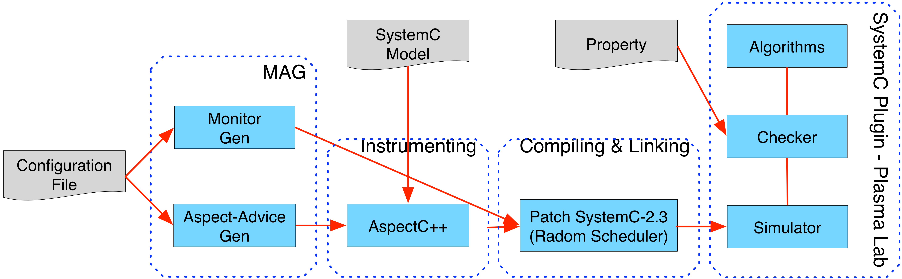
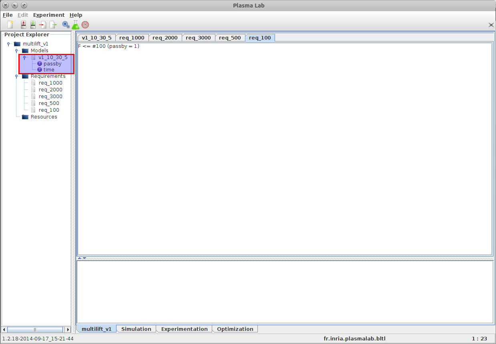

SystemC
=======

SystemC is a high-level modelling language for specifying concurrent processes.
It is implemented as a set of C++ classes that allow to perform event-driven
simulation. Probabilistic behaviors can also be added.

We have implemented a SystemC plugin for PLASMA Lab that is able to load
a SystemC executable model and use it to generate simulations. PLASMA Lab and
the SystemC plugin are embedded in the toolchain of the `Probabilistic SystemC Verifier (PSCV) <https://project.inria.fr/pscv/>`__ tool:

This manual explains how to use PLASMA Lab's SystemC Plugin and the MAG tool in order to perform statistical model checking on SystemC models.
Running the verification framework consists of two steps:

1. Generating an executable model corresponding to the verification of properties using the MAG tool
2. Using the SystemC plugin plugin to verify the properties.

Download
--------

The following tools are required to use the SystemC plugin:

- Monitor and Aspect-advice Generator: `MAG 1.0 <https://project.inria.fr/plasma-lab/mag-1-0-tar-2/>`__
- Aspect-oriented Programming with C/C++: `AspectC++ 1.2 <http://aspectc.org/Download.php>`__
- Patched version of SystemC in `CHIMP 1.0 <http://sourceforge.net/projects/chimp-rice/>`__

Installation
------------

To compile and install MAG, AspectC++ and the patched version of SystemC, refer to the `MAG user guide <https://project.inria.fr/plasma-lab/files/2015/09/MAG_UserGuide.pdf>`__.

Generating Executable Model with MAG
------------------------------------

In order to run the SystemC plugin to verify properties, users first need to generate an executable model from the original SystemC model. It consists of three steps:

1. Use MAG to generate the monitors and the aspect-advice file.
2. Run AspectC++ with the generated aspect-advice file on the generated monitors and original model code to instrument the original model code.
3. Compile (e.g., with g++) the instrumented SystemC model code to produce the corresponding executable model

Users run MAG to generate the monitors and aspect-advices according to the properties verified as follows:

1. Write the configuration file according to the properties verified (see the `MAG user guide <https://project.inria.fr/plasma-lab/files/2015/09/MAG_UserGuide.pdf>`__ for more details)
2. Change to the directory of the MAG tool and run ``mag -conf “configuration file``.
3. MAG generates three files: header and source files of the generated monitor, and the aspect advice file *aspect_definitions.ah* in the location defined in the configuration file.

Users run AspectC++ with the aspect-advice file on the original model source code and the generated monitors to generate the instrumented SystemC model.

1. Change the directory of AspectC++ 1.2
2. Run the following command to generate puma.config file in the working directory: ``ag++ –gen_config``
3. Copy the header and source files of the generated monitors and the aspect-advice file *aspect_definitions.ah* into the source directory of the original model source code
4. For each header or source file of the SUV, run the following command to generate the instrumented version:

   ``ac++ -c`` *source_path/input_file* ``-o`` *target_path/output_file* ``-p`` *source_path* ``-I`` *source_path* ``-I`` *systemc_path/include* ``–config`` *aspectc_path/puma.config*
    
   where *source_path* is the path to the source directory of the original model source code, *target_path* is the path to the directory where the AspectC++ puts the instrumented version, *systemc_path* is the path to the patched version of systemc-2.3.0 (included in CHIMP), and *aspectc_path* is the path to the AspectC++ 1.2.

Compiling the instrumented model source code is done as follows:

1. In the main header file , include the generated monitor header file, for example ``#include monitor_multi_lift.h``
2. In the main source file, add the following line just before the call to ``sc_start()``:

   ``mon_observer* obs = local_observer::createInstance(1, other_parameters);``

   The parameters depend on the generated monitor, for example, in the included example of multi-lift system in the MAG tool package, it is:
    
   ``mon_observer* obs  =  local_observer::createInstance(1, &liftsystem);``

3. Compile the instrumented model source code with g++ compiler and link it with the patched SystemC

We also provide shell scripts in the example directory of MAG tool that automatically generate the instrumented model source code. 
User can modify them according to their configuration and requirements.

Running the SystemC Plugin within PLASMA Lab
--------------------------------------------

After compiling the instrumented SystemC model, an executable model is produced. 
Users can then verify the desired properties with the SystemC plugin of Plasma as follows:

1. Launch PLASMA Lab with the SystemC plugin loaded.
2. Create a new model of the type *SystemC Specification*. The content of the model is the path to the executable model
3. Write the properties to verify, based on the observed variables that are available in the executable model, as shown in the following figure (inside the red area):

4. Check the properties in the *Experimentation panel*
